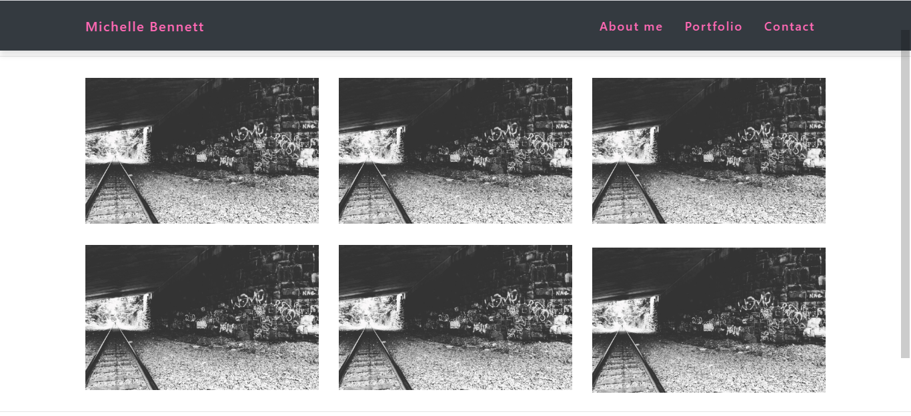
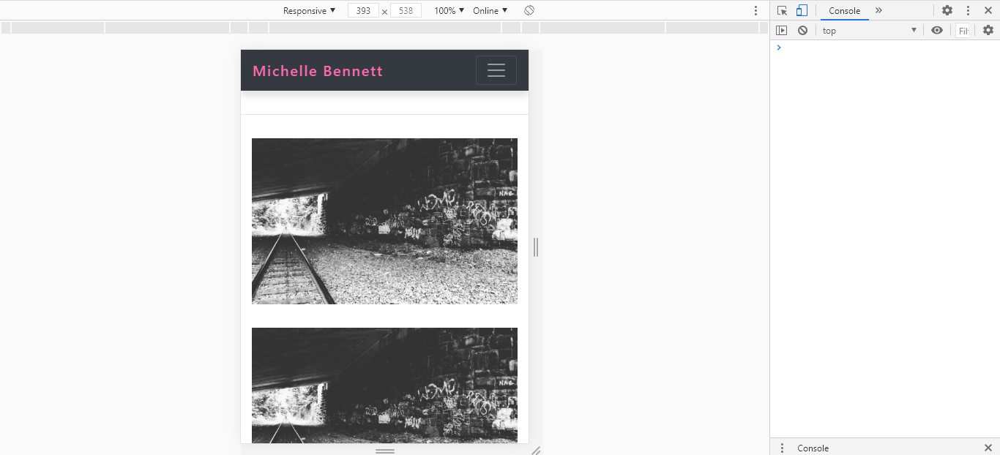

# Week-3-Bootstrap-Portfolio# 

### Description
In this project, I have created a Bootstrap Portfolio. I recently have been learning more about Responsive design and Bootstrap through the course, as well as through doing multiple different tutorials. I was inspired to do this assignment from my curiosity to learn more about how to build mobile-first, responsive websites. Here, you can find the links to the variety of some of the things I have learned.

---

### Table of Contents
* [Installation](#Installation) 
* [Usage](#Usage)  
* [Credits](#Credits)  
* [Badges](#Badges)  
* [License](#License)

---

### Installation 
<a href = "https://mbennett1991.github.io/Week-3-Bootstrap-Portfolio/Homework/index.html">Click me</a> to see my portfolio in action!

---

### Usage  
To further show the responsiveness of the portfolio I have included screenshots of the portfolio page to show what they look like on different screen sizes.

---

### Links
Below are links to the individual pages within the portfolio.

<a href = "https://mbennett1991.github.io/Week-3-Bootstrap-Portfolio/Homework/about-me.html">About Me</a>

<a href = "https://mbennett1991.github.io/Week-3-Bootstrap-Portfolio/Homework/portfolio.html">Portfolio</a>

<a href = "https://mbennett1991.github.io/Week-3-Bootstrap-Portfolio/Homework/contact.html">Contact Page</a>
 
---
  
### Credits
@ChiggyO

---

### Badges 

---

### License 
© 2020 Trilogy Education Services, a 2U, Inc. brand. All Rights Reserved.